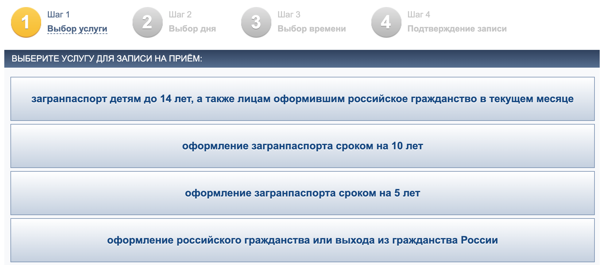

# Configuration

## settings.json

In this file, there are instructions that indicate which services, in which consulates in which countries the script will check. The file is in JSON-format and it will be validated on the start of the script, so stick to the schema.

By default, the file is configured for searching for submission of documents for a international passport in all Russian consulates in Kazakhstan. Use it as an example. Notice that you should specify the place of application for service and service title exactly as it designated at [QMIDPASS.RU](https://q.midpass.ru/).

Places of application for service is located on login page:


The services titles are presented on a first page after login:


## .env-file

.env-file keeps the private information about the user. Create it in base directory on the same level as Dockerfile, if you want to run script in docker. Otherwise, create it in app folder:

```touch .env```

There is a structure of file:
```
EMAIL_FOR_QMIDPASS=testmail@gmail.com
PASSWORD_FOR_QMIDPASS=Xx0x0X0

API_KEY_FOR_2CAPTCHA=xxxxxxxxxxxxx

SENDER_EMAIL=testmail@gmail.com
SENDER_PASSWORD=xxxxxxxxxxxxxxxx

RECEIVERS_EMAILS=testmail1@gmail.com,testmail2@gmail.com

AUTO_APPLICATION=false
```

First two lines are your credentials to login to [QMIDPASS.RU](https://q.midpass.ru/). Get it there.

Also the script needs to solve captcha to login. It deals with captcha via [2captcha](2captcha.com) service. Create an account here, put some money on it and get API_KEY.

The script sends info emails when there are available slots for the service. To do it you should configure email from where these messages will be sent with SENDER_EMAIL, SENDER_PASSWORD and PORT. Different mail services has different procedures, google your own. Here is the example for [Yandex.Mail](https://yandex.com/support/mail/mail-clients/others.html).

Then you need to specify on which emails the message will be delivered. Write these addresses in RECEIVERS_EMAILS separated with comma without space. In case there is only one address, write it without comma.

Finally, specify if you want script to automatically apply for a service, or only to notify you about a vacant slots. In the first case set AUTO_APPLICATION=true, otherwise set AUTO_APPLICATION=false.

If you selected AUTO_APPLICATION=true, also add the following info to the file. Example:
```
NAME=Иван
SURNAME=Иванов
PATRONYMIC=Иванович
BIRTH_DATE=01.01.2000
PHONE_NUMBER=+79998887766
ADDRESS=город, улица, дом, квартира
```

## docker-compose

The script uses ofelia-image to shedule running of the script inside docker-container. In docker-compose you can set the frequency of this process:
```
ofelia.job-exec.app.schedule: "@every 15m"
```
By default script is called every 15 minutes. Change it as you like.

# Install

## As docker container (recommended)

After configuration, if you have docker and docker-compose installed, just run this command to build an image:
```
docker-compose build
```

## As python script 

Change directory to app, then install the script:
```
cd app
pip install .
```

# Run

## As docker-container (recommended)

After the image is built, run:
```
docker-compose up
```

## As python script

Just run it with:
```
consulate-checker
```
Notice that by this script will be executed just once. To run it regularly use cron or similar instrument.
